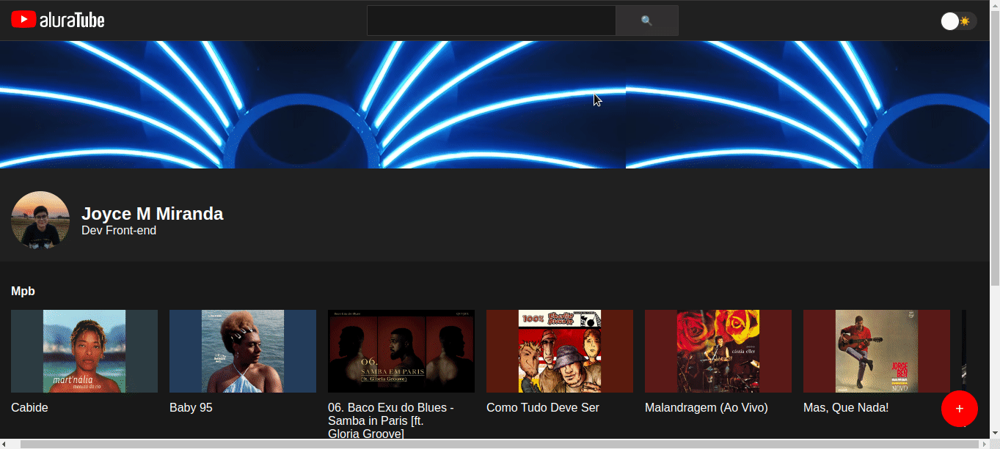

<h1> Aluratube</h1>

Este projeto foi realizado durante a imersão react da <a href="">alura</a> e foi desenvolvido utilizando React, Next, e CSS. 

Esta aplicação foi inspirada no YouTube, nela é possível alterar o modo de visualização da aplicação para modo claro ou modo escuro, é possível também buscar pelo vídeo desejado. 

    

    <h5>Ferramenta de Busca</h5>
    

#### Scripts

Para baixar as dependências do projeto:

#### `npm install`

Para rodar o projeto:

#### `npm start`